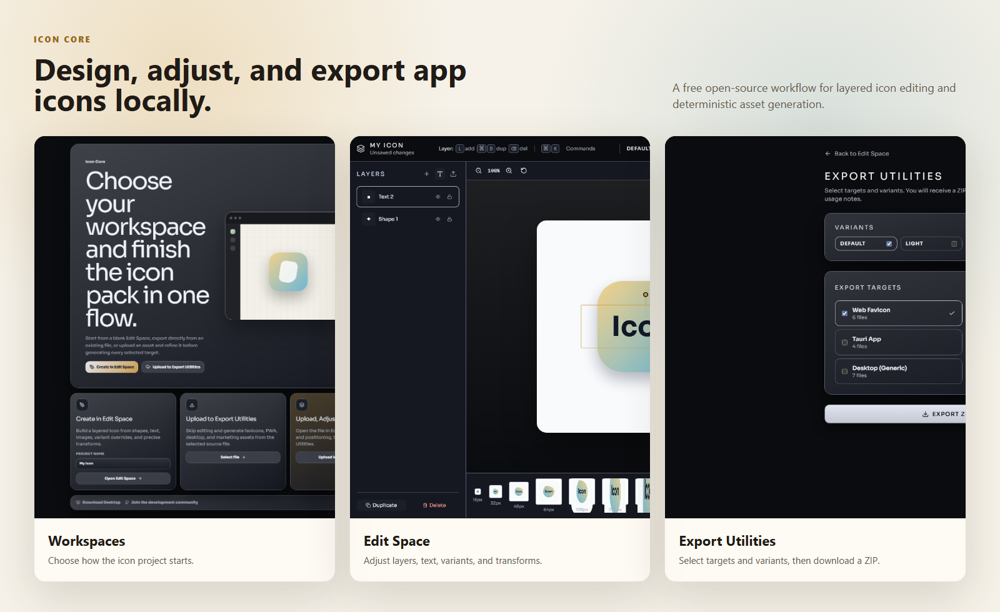

# Icon Core

[English](README.md) | [Português (Brasil)](README.pt-BR.md) | [Español](README.es-ES.md)

Icon Core es un workspace gratuito y open source para iconos de aplicaciones. Empieza con un lienzo vacío o importa un archivo SVG/PNG/JPG/WebP, ajusta el icono y exporta assets listos para web y desktop.

Todo se ejecuta localmente en el navegador o en la app desktop. No requiere cuenta, servicio de subida ni backend.



## Probar

- App web: https://mafhper.github.io/icon-core/app/
- Landing page: https://mafhper.github.io/icon-core/
- Releases desktop: https://github.com/mafhper/icon-core/releases
- Repositorio: https://github.com/mafhper/icon-core

## Workspaces

| Workspace | Úsalo cuando |
| --- | --- |
| Create in Edit Space | Quieres construir un icono con capas, texto, formas e imágenes. |
| Upload to Export Utilities | Ya tienes el archivo final y solo necesitas generar los assets. |
| Upload, Adjust, Export | Quieres importar un archivo, ajustarlo y luego exportar el paquete final. |

## Funcionalidades

- Edición por capas para imágenes, SVG, formas y texto
- Controles de posición, escala, rotación, opacidad, color, gradiente, blend mode y sombra
- Ajustes por variante para iconos default, light, dark y mono
- Exportación para favicon, PWA, Tauri, Electron y desktop genérico
- ZIP con archivos renderizados, manifiestos, reportes y notas de uso
- Apps web y desktop basadas en el mismo modelo de proyecto

## Desarrollo

Requisitos:

- Bun 1.3+
- Node.js 20+
- Toolchain de Rust para builds desktop

Instala dependencias:

```bash
bun install
```

Ejecuta la app web:

```bash
bun run dev:web
```

Ejecuta la landing page:

```bash
bun run dev:promo
```

Genera el build para GitHub Pages:

```bash
bun run build
```

Ejecuta la validación:

```bash
bun audit --audit-level=high
bun run lint
bun run typecheck
bun run test
```

Genera los bundles desktop:

```bash
bun run build:desktop
```

## Repositorio

```text
apps/
  promo/      Landing page pública
  web/        App del navegador
  desktop/    Shell desktop en Tauri
packages/
  iconcore-shared/     Tipos compartidos del proyecto
  iconcore-renderer/   Renderización Canvas/SVG
  iconcore-exporters/  Targets de assets y entradas del ZIP
  iconcore-engine/     Planificación y utilidades de schema
  iconcore-validator/  Validación de proyectos
  iconcore-cli/        Herramientas de línea de comando
```

## Contribución

Issues, correcciones y experimentos son bienvenidos. Mantén los cambios enfocados, ejecuta los checks relevantes e incluye notas de validación en los pull requests.

## Licencia

Licencia MIT. Ver [LICENSE](LICENSE).
