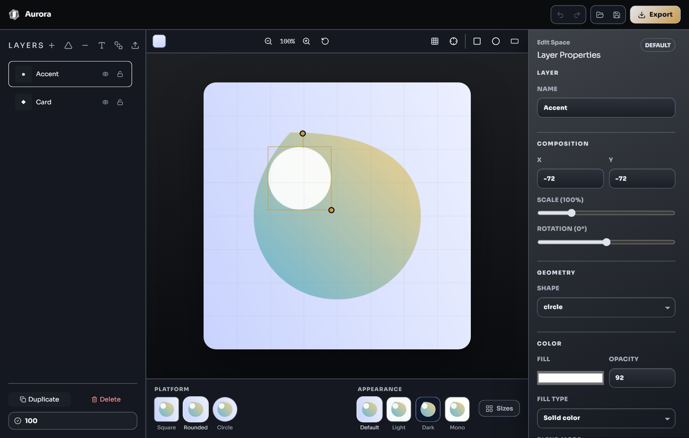
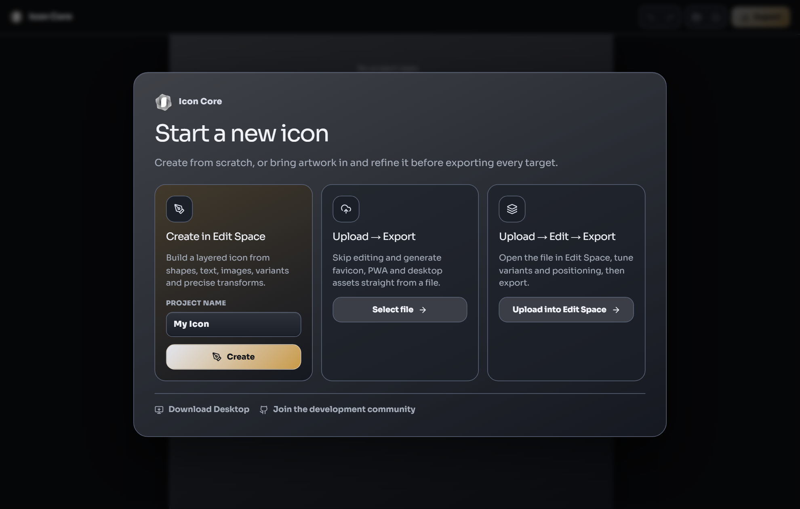
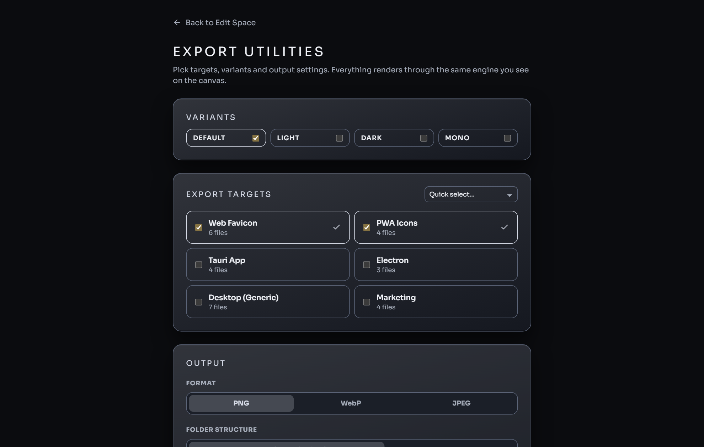
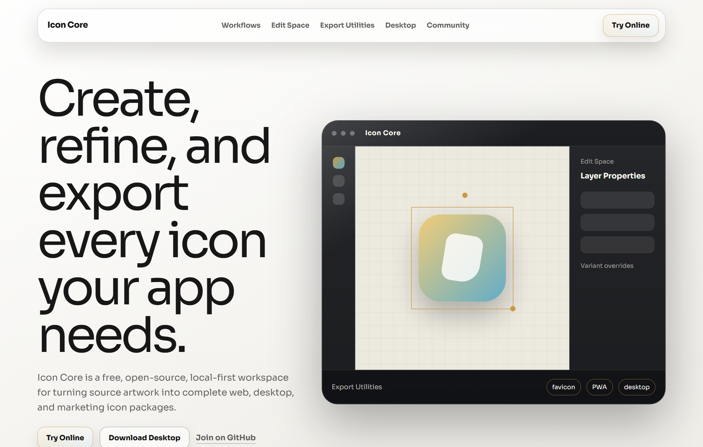

# Icon Core

[English](README.md) | [Português (Brasil)](README.pt-BR.md) | [Español](README.es-ES.md)

Icon Core é um workspace gratuito e open source para ícones de aplicativos. Comece com uma tela vazia ou importe um arquivo SVG/PNG/JPG/WebP, ajuste o ícone e exporte assets prontos para web e desktop.

Tudo roda localmente no navegador ou no app desktop. Não exige conta, serviço de upload ou backend.



| Começar um novo ícone | Export Utilities |
| --- | --- |
|  |  |

## Teste

- App web: https://mafhper.github.io/icon-core/app/
- Landing page: https://mafhper.github.io/icon-core/
- Releases desktop: https://github.com/mafhper/icon-core/releases
- Repositório: https://github.com/mafhper/icon-core

[](https://mafhper.github.io/icon-core/)

## Workspaces

| Workspace | Use quando |
| --- | --- |
| Create in Edit Space | Você quer montar um ícone com camadas, texto, formas e imagens. |
| Upload to Export Utilities | Você já tem o arquivo final e só precisa gerar os assets. |
| Upload, Adjust, Export | Você quer importar um arquivo, ajustar e depois exportar o pacote final. |

## Funcionalidades

- **Canvas WYSIWYG** — o preview ao vivo usa o mesmo motor da exportação, então o que você vê é o que você exporta
- Edição em camadas para imagens, SVG, formas e texto, com controles de posição, escala, rotação, opacidade, cor, gradiente, blend mode e sombra
- Pré-visualização de aparência e plataforma (default / light / dark / mono · quadrado / arredondado / círculo) e ajustes por variante
- Safe area apenas como guia — os ícones ficam full-bleed e cada plataforma aplica a própria máscara
- Exportação para favicon, PWA, Tauri, Electron e desktop genérico
- Saída flexível: PNG / WebP / JPEG, qualidade, estrutura aninhada ou plana, ZIP ou pasta escolhida (desktop), compressão, página de teste HTML e relatórios por target
- Apps web e desktop usando o mesmo modelo de projeto

## Desenvolvimento

Pré-requisitos:

- Bun 1.3+
- Node.js 20+
- Toolchain Rust para builds desktop

Instale as dependências:

```bash
bun install
```

Rode o app web:

```bash
bun run dev:web
```

Rode a landing page:

```bash
bun run dev:promo
```

Gere o build do GitHub Pages:

```bash
bun run build
```

Rode a validação:

```bash
bun audit --audit-level=high
bun run lint
bun run typecheck
bun run test
```

Gere os bundles desktop:

```bash
bun run build:desktop
```

## Repositório

```text
apps/
  promo/      Landing page pública
  web/        App no navegador
  desktop/    Shell desktop em Tauri
packages/
  iconcore-shared/     Tipos compartilhados do projeto
  iconcore-renderer/   Renderização Canvas/SVG
  iconcore-exporters/  Targets de assets e entradas do ZIP
  iconcore-engine/     Planejamento e utilitários de schema
  iconcore-validator/  Validação de projetos
  iconcore-cli/        Ferramentas de linha de comando
```

## Contribuição

Issues, correções e experimentos são bem-vindos. Mantenha as mudanças focadas, rode os checks relevantes e inclua notas de validação nos pull requests.

## Licença

Licença MIT. Veja [LICENSE](LICENSE).
